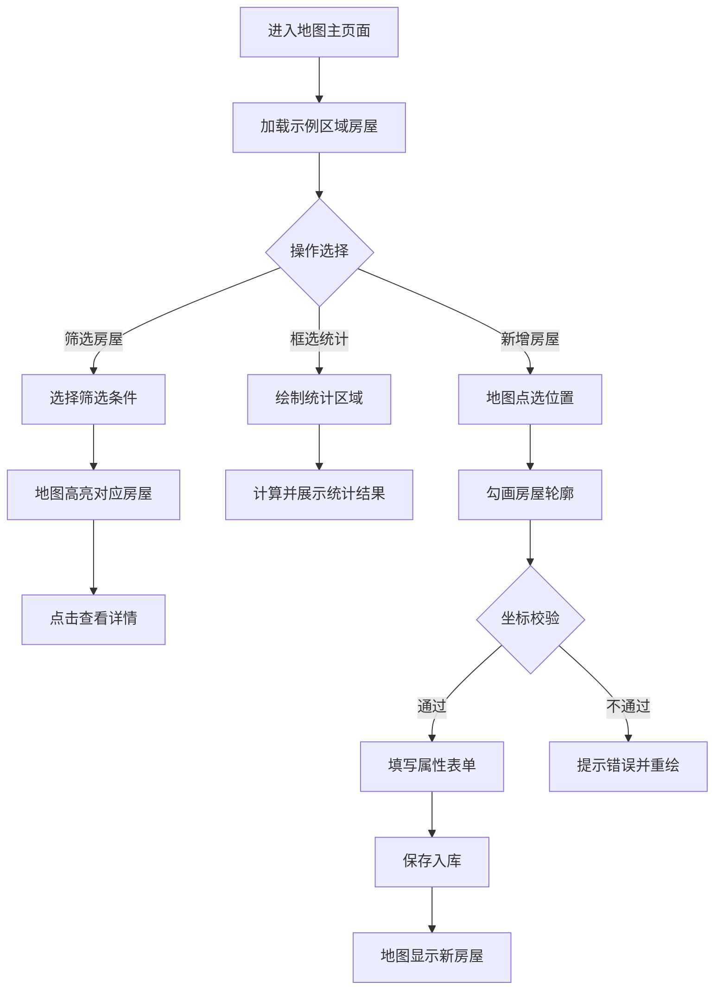

## 1. 产品概述

房屋落图查询系统是一个不动产统一赋码管理平台，实现房屋空间位置与属性信息的一体化管理。通过交互式地图直观展示房屋分布，支持按多维度筛选、框选统计、新增录入等功能，为不动产赋码管理提供可视化支撑。

- 解决房屋赋码后"有码无图"的问题，实现赋码落图一体化管理
- 目标用户：不动产登记人员、房管部门、城市规划管理人员

## 2. 核心功能

### 2.1 用户角色

| 角色 | 注册方式 | 核心权限 |
|------|----------|----------|
| 管理员 | 系统预置 | 完整权限：查看、筛选、统计、录入、后台管理 |
| 普通用户 | 系统分配 | 查看、筛选、统计功能 |

### 2.2 功能模块

1. **地图主页面**：交互式地图展示、房屋点位图层、筛选面板、框选统计
2. **房屋详情弹窗**：统一代码展示、属性信息、全生命周期阶段
3. **新增房屋录入**：地图点选位置、勾画轮廓、坐标校验、表单填写
4. **后台统计页面**：落图统计报表、未落图清单、坐标缺失率分析

### 2.3 页面详情

| 页面名称 | 模块名称 | 功能描述 |
|----------|----------|----------|
| 地图主页面 | 地图展示区 | Leaflet交互式地图，支持缩放、平移、底图切换 |
| 地图主页面 | 房屋点图层 | 按区域展示房屋点位，颜色区分用途或建成年代 |
| 地图主页面 | 筛选面板 | 按用途、建成年代、赋码状态多条件筛选，地图实时高亮 |
| 地图主页面 | 框选统计 | 绘制矩形/圆形区域，统计圈内房屋栋数、各用途占比 |
| 地图主页面 | 顶部导航 | 页面切换、视图切换（用途着色/年代着色） |
| 房屋详情弹窗 | 基本信息 | 统一代码、地址、建筑面积、层数 |
| 房屋详情弹窗 | 空间信息 | 坐标、轮廓、所属宗地、所属项目 |
| 房屋详情弹窗 | 生命周期 | 当前阶段（规划/建设/验收/登记/注销）及时间线 |
| 新增房屋录入 | 地图交互 | 点选位置、绘制多边形轮廓、实时坐标校验 |
| 新增房屋录入 | 表单填写 | 房屋属性信息录入，下拉选择宗地和项目 |
| 新增房屋录入 | 校验提示 | 重叠检测、宗地范围检测，实时反馈错误信息 |
| 后台统计页面 | 区域统计 | 按区域、按用途统计落图房屋数量 |
| 后台统计页面 | 未落图清单 | 展示已赋码但未落图的房屋列表 |
| 后台统计页面 | 质量分析 | 坐标缺失率、属性完整率统计图表 |

## 3. 核心流程

### 3.1 房屋查询流程
用户进入地图主页面 → 默认展示示例区域房屋点位 → 通过筛选面板选择条件 → 地图实时高亮符合条件的房屋 → 点击某栋房屋查看详情 → 查看统一代码、属性、生命周期

### 3.2 框选统计流程
用户点击"框选统计"按钮 → 在地图上绘制矩形/圆形区域 → 系统自动计算圈内房屋 → 展示统计结果（总栋数、各用途占比饼图）→ 可导出统计结果

### 3.3 新增房屋流程
用户点击"新增房屋" → 在地图上点选中心点 → 沿房屋轮廓依次点击绘制多边形 → 系统实时校验（是否重叠、是否在宗地内）→ 填写属性表单 → 提交保存 → 地图上显示新房屋点位

## 4. 用户界面设计

### 4.1 设计风格
- **主色调**：深蓝色系（#1e3a5f），体现政务系统的专业稳重
- **辅助色**：房屋用途配色（住宅#4CAF50、商业#FF9800、工业#2196F3、公共#9C27B0）
- **建成年代配色**：渐变色系，从老旧（#8D6E63）到新建（#66BB6A）
- **按钮风格**：圆角矩形，轻微阴影，hover时有上浮效果
- **字体**：标题使用"Noto Sans SC"，正文使用系统无衬线字体
- **布局风格**：左侧固定筛选面板 + 右侧全屏地图 + 顶部导航栏
- **图标风格**：使用Font Awesome线性图标，简洁统一

### 4.2 页面设计概述

| 页面名称 | 模块名称 | UI元素 |
|----------|----------|--------|
| 地图主页面 | 顶部导航 | 深色背景、白色文字、左侧logo、右侧功能按钮组 |
| 地图主页面 | 筛选面板 | 半透明白色背景、圆角边框、阴影效果、分组折叠 |
| 地图主页面 | 地图区域 | 全屏展示、右下角比例尺、左上角缩放控件 |
| 地图主页面 | 房屋点位 | 圆形Marker、按用途/年代着色、点击波纹效果 |
| 房屋详情弹窗 | 弹窗卡片 | 从右侧滑入、毛玻璃背景、多标签页切换 |
| 新增房屋录入 | 引导步骤 | 步骤指示器、地图绘制提示、实时校验信息 |
| 后台统计页面 | 统计卡片 | 网格布局、数据大屏风格、图表动效 |

### 4.3 响应性
- Desktop-first设计，主适配1920×1080分辨率
- 平板端：筛选面板改为可折叠抽屉式
- 移动端：简化筛选功能，重点保障地图浏览体验
- 触摸设备优化：增大点位点击区域，支持双指缩放

### 4.4 动画与交互
- 页面加载：地图淡入，点位分批延迟出现
- 筛选变化：点位缩放过渡动画，非选中项淡出
- 弹窗出现：右侧滑入 + 轻微弹性效果
- 悬停效果：点位放大、阴影增强
- 统计图表：数据加载时的渐进式绘制动画
