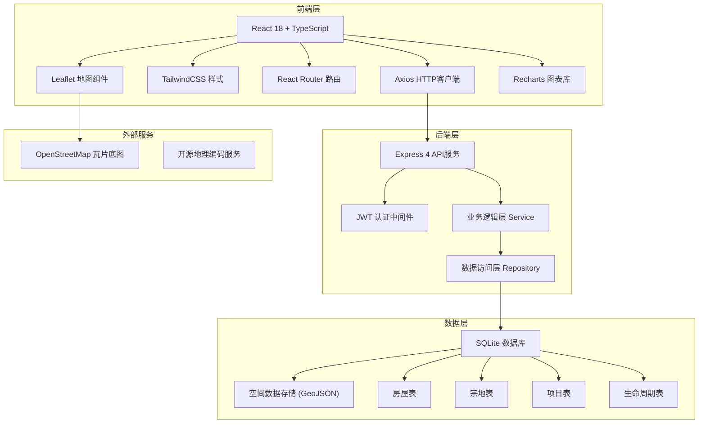
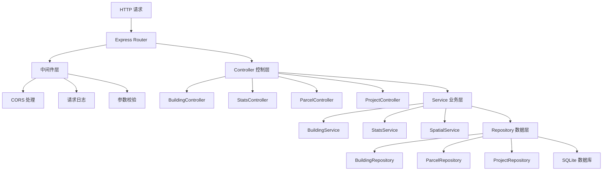
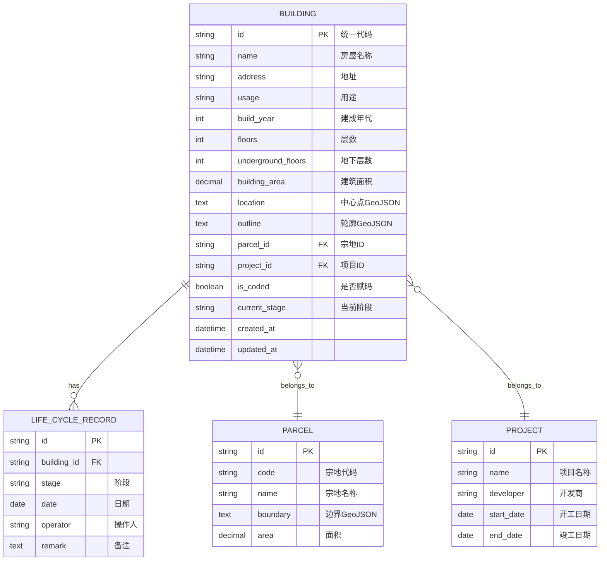

## 1. 架构设计



## 2. 技术描述

- **前端**：React@18 + TypeScript + TailwindCSS@3 + Vite@5
- **初始化工具**：Vite 5.x
- **地图库**：Leaflet@1.9 + react-leaflet@4.2
- **图表库**：Recharts@2.10
- **HTTP客户端**：Axios@1.6
- **路由**：React Router@6.20
- **后端**：Express@4 + TypeScript
- **数据库**：SQLite3 + better-sqlite3
- **空间计算**：@turf/turf（前端）
- **图标**：Font Awesome@6

## 3. 目录结构

```
spatialmap/
├── client/                    # 前端应用
│   ├── src/
│   │   ├── components/        # 组件
│   │   │   ├── Map/          # 地图相关组件
│   │   │   ├── Filter/       # 筛选面板
│   │   │   ├── Modal/        # 弹窗组件
│   │   │   └── Stats/        # 统计组件
│   │   ├── pages/            # 页面
│   │   │   ├── MapPage.tsx
│   │   │   ├── AddBuilding.tsx
│   │   │   └── Dashboard.tsx
│   │   ├── services/         # API服务
│   │   ├── types/            # TypeScript类型定义
│   │   ├── utils/            # 工具函数（空间计算等）
│   │   └── App.tsx
│   └── package.json
├── server/                    # 后端应用
│   ├── src/
│   │   ├── controllers/      # 控制器
│   │   ├── services/         # 业务逻辑
│   │   ├── repositories/     # 数据访问
│   │   ├── models/           # 数据模型
│   │   ├── routes/           # 路由定义
│   │   ├── middleware/       # 中间件
│   │   ├── db/               # 数据库初始化
│   │   └── server.ts
│   └── package.json
├── data/                      # 数据目录
│   └── spatialmap.db         # SQLite数据库文件
└── package.json              # 根package.json（monorepo）
```

## 4. 路由定义

| 路由 | 页面 | 说明 |
|------|------|------|
| / | 地图主页面 | 默认首页，展示交互式地图和房屋点位 |
| /add | 新增房屋 | 在地图上点选位置、勾画轮廓、录入信息 |
| /dashboard | 后台统计 | 落图统计、未落图清单、质量分析 |

## 5. API 定义

### 5.1 TypeScript 类型定义

```typescript
// 空间坐标点
interface Point {
  type: 'Point';
  coordinates: [number, number]; // [经度, 纬度]
}

// 多边形轮廓
interface Polygon {
  type: 'Polygon';
  coordinates: [number, number][][];
}

// 房屋用途枚举
type BuildingUsage = 'residential' | 'commercial' | 'industrial' | 'public' | 'other';

// 生命周期阶段
type LifeCycleStage = 'planning' | 'construction' | 'acceptance' | 'registration' | 'cancelled';

// 房屋实体
interface Building {
  id: string;                     // 统一代码（主键）
  name: string;                   // 房屋名称
  address: string;                // 地址
  usage: BuildingUsage;           // 用途
  buildYear: number;              // 建成年代
  floors: number;                 // 地上层数
  undergroundFloors: number;      // 地下层数
  buildingArea: number;           // 建筑面积
  location: Point;                // 中心点坐标
  outline: Polygon;               // 轮廓多边形
  parcelId: string;               // 所属宗地ID
  projectId: string;              // 所属项目ID
  isCoded: boolean;               // 是否已赋码
  currentStage: LifeCycleStage;   // 当前生命周期阶段
  createdAt: string;
  updatedAt: string;
}

// 宗地
interface Parcel {
  id: string;
  code: string;                   // 宗地代码
  name: string;
  boundary: Polygon;              // 宗地边界
  area: number;                   // 宗地面积
}

// 项目
interface Project {
  id: string;
  name: string;
  developer: string;
  startDate: string;
  endDate: string;
}

// 生命周期记录
interface LifeCycleRecord {
  id: string;
  buildingId: string;
  stage: LifeCycleStage;
  date: string;
  operator: string;
  remark: string;
}

// 筛选条件
interface FilterParams {
  usage?: BuildingUsage[];
  yearStart?: number;
  yearEnd?: number;
  isCoded?: boolean;
  region?: Polygon;               // 空间范围筛选
}

// 统计结果
interface StatsResult {
  totalCount: number;
  byUsage: { usage: BuildingUsage; count: number; percentage: number }[];
  byYear: { year: number; count: number }[];
}
```

### 5.2 API 接口列表

| 方法 | 路径 | 说明 |
|------|------|------|
| GET | /api/buildings | 获取房屋列表（支持筛选） |
| GET | /api/buildings/:id | 获取单栋房屋详情 |
| POST | /api/buildings | 新增房屋 |
| PUT | /api/buildings/:id | 更新房屋信息 |
| DELETE | /api/buildings/:id | 删除房屋 |
| GET | /api/buildings/within | 获取指定范围内的房屋 |
| GET | /api/buildings/stats | 统计房屋数据 |
| POST | /api/buildings/validate | 校验房屋坐标（重叠、宗地范围） |
| GET | /api/parcels | 获取宗地列表 |
| GET | /api/projects | 获取项目列表 |
| GET | /api/stats/overview | 后台总览统计 |
| GET | /api/stats/unmapped | 获取未落图房屋清单 |
| GET | /api/stats/quality | 获取质量分析数据 |

### 5.3 空间校验接口

**POST /api/buildings/validate**

请求体：
```typescript
{
  location: Point;
  outline: Polygon;
  parcelId: string;
  excludeId?: string; // 编辑时排除自身
}
```

响应：
```typescript
{
  valid: boolean;
  errors: {
    type: 'overlap' | 'outside_parcel';
    message: string;
    overlappingBuildings?: string[];
  }[];
}
```

## 6. 服务端架构



## 7. 数据模型

### 7.1 ER 图



### 7.2 DDL 语句

```sql
-- 宗地表
CREATE TABLE parcels (
  id TEXT PRIMARY KEY,
  code TEXT NOT NULL UNIQUE,
  name TEXT NOT NULL,
  boundary TEXT NOT NULL, -- GeoJSON格式
  area REAL NOT NULL,
  created_at DATETIME DEFAULT CURRENT_TIMESTAMP,
  updated_at DATETIME DEFAULT CURRENT_TIMESTAMP
);

-- 项目表
CREATE TABLE projects (
  id TEXT PRIMARY KEY,
  name TEXT NOT NULL,
  developer TEXT,
  start_date TEXT,
  end_date TEXT,
  created_at DATETIME DEFAULT CURRENT_TIMESTAMP,
  updated_at DATETIME DEFAULT CURRENT_TIMESTAMP
);

-- 房屋表
CREATE TABLE buildings (
  id TEXT PRIMARY KEY, -- 统一代码
  name TEXT NOT NULL,
  address TEXT NOT NULL,
  usage TEXT NOT NULL CHECK (usage IN ('residential', 'commercial', 'industrial', 'public', 'other')),
  build_year INTEGER NOT NULL,
  floors INTEGER DEFAULT 0,
  underground_floors INTEGER DEFAULT 0,
  building_area REAL DEFAULT 0,
  location TEXT, -- GeoJSON Point，可为空表示未落图
  outline TEXT,  -- GeoJSON Polygon，可为空
  parcel_id TEXT,
  project_id TEXT,
  is_coded INTEGER DEFAULT 1,
  current_stage TEXT NOT NULL DEFAULT 'registration',
  created_at DATETIME DEFAULT CURRENT_TIMESTAMP,
  updated_at DATETIME DEFAULT CURRENT_TIMESTAMP,
  FOREIGN KEY (parcel_id) REFERENCES parcels(id),
  FOREIGN KEY (project_id) REFERENCES projects(id)
);

-- 生命周期记录表
CREATE TABLE life_cycle_records (
  id TEXT PRIMARY KEY,
  building_id TEXT NOT NULL,
  stage TEXT NOT NULL,
  date TEXT NOT NULL,
  operator TEXT,
  remark TEXT,
  created_at DATETIME DEFAULT CURRENT_TIMESTAMP,
  FOREIGN KEY (building_id) REFERENCES buildings(id)
);

-- 空间索引（SQLite R*Tree）
CREATE VIRTUAL TABLE IF NOT EXISTS building_rtree USING rtree(
  id,               -- 房屋ID
  min_x, max_x,     -- 经度范围
  min_y, max_y      -- 纬度范围
);

-- 常用索引
CREATE INDEX idx_buildings_usage ON buildings(usage);
CREATE INDEX idx_buildings_year ON buildings(build_year);
CREATE INDEX idx_buildings_coded ON buildings(is_coded);
CREATE INDEX idx_buildings_parcel ON buildings(parcel_id);
CREATE INDEX idx_lifecycle_building ON life_cycle_records(building_id);
```

### 7.3 初始化示例数据

```sql
-- 示例宗地（以北京市朝阳区某区域为例）
INSERT INTO parcels (id, code, name, boundary, area) VALUES 
('P001', '110105001001GB00001', '朝阳宗地A', '{"type":"Polygon","coordinates":[[[116.445,39.925],[116.455,39.925],[116.455,39.935],[116.445,39.935],[116.445,39.925]]]}', 12000);

-- 示例项目
INSERT INTO projects (id, name, developer, start_date, end_date) VALUES
('PRJ001', '阳光花园小区', '北京阳光地产', '2018-03-15', '2020-12-30');

-- 示例房屋（50栋，覆盖不同用途和年代）
INSERT INTO buildings (id, name, address, usage, build_year, floors, building_area, location, outline, parcel_id, project_id, is_coded, current_stage) VALUES
('110105001001GB00001F0001', '阳光花园1号楼', '北京市朝阳区阳光路1号', 'residential', 2020, 18, 12000, '{"type":"Point","coordinates":[116.446,39.926]}', '{"type":"Polygon","coordinates":[[[116.4458,39.9258],[116.4462,39.9258],[116.4462,39.9262],[116.4458,39.9262],[116.4458,39.9258]]]}', 'P001', 'PRJ001', 1, 'registration'),
-- ... 更多示例房屋数据
```

## 8. 前端组件设计

### 8.1 核心组件树

```
App.tsx
├── Navbar.tsx                  # 顶部导航
├── FilterPanel.tsx             # 左侧筛选面板
│   ├── UsageFilter.tsx         # 用途筛选
│   ├── YearFilter.tsx          # 年代筛选
│   └── CodeStatusFilter.tsx    # 赋码状态筛选
├── MapContainer.tsx            # 地图容器
│   ├── BaseMap.tsx             # 底图图层
│   ├── BuildingMarkers.tsx     # 房屋点位图层
│   ├── DrawControl.tsx         # 绘制控件（框选、新增）
│   └── MapTooltip.tsx          # 地图提示
├── BuildingDetail.tsx          # 房屋详情侧边栏
├── StatsModal.tsx              # 框选统计弹窗
└── Drawer.tsx                  # 通用抽屉组件
```

### 8.2 状态管理

使用 React Context + useReducer 管理全局状态：
- `FilterContext`：筛选条件状态
- `MapContext`：地图视图状态（中心点、缩放级别、着色模式）
- `BuildingContext`：房屋数据状态
